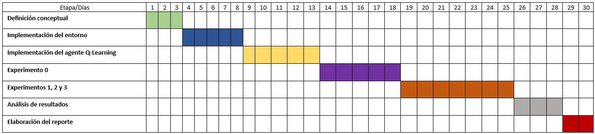

# **Anteproyecto IA1 - 2025**

## **Multi-Agent / Public Goods Prisoner’s Dilemma**

**Código:** `QOOPERATE`

**Integrantes:** Emiliano Germani, Julia Kröpfl y Adriano Fabris

---

## **Objetivo**

El proyecto busca explorar el surgimiento o colapso de la cooperación en sociedades artificiales dinámicas compuestas
por agentes que aprenden mediante refuerzo, evaluando cómo la estructura social (topología de red) y el alcance de la
información local influyen en el comportamiento colectivo.

La meta principal es observar bajo qué condiciones emergen patrones estables de cooperación en entornos donde los
individuos actúan racionalmente pero con información limitada, y cómo el aprendizaje local puede conducir a resultados
globales cooperativos o egoístas.

---

## **Teoría Involucrada**

El trabajo se apoya en dos ejes conceptuales: el **Reinforcement Learning** y la **Game Theory**.

En el primero, cada agente aplica el algoritmo **Q-Learning**, cuya regla de actualización se expresa como:

$$
Q(s,a) \leftarrow Q(s,a) + \alpha \big(r + \gamma \max_{a'} Q(s',a') - Q(s,a)\big)
$$

donde $\alpha$ es la tasa de aprendizaje, $\gamma$ el factor de descuento, $r$ la recompensa inmediata y $(s, a)$ el par
estado-acción.
En un entorno multiagente, cada individuo percibe un _entorno no estacionario_, ya que los demás también aprenden y
adaptan su política, generando una dinámica colectiva cambiante. Por tanto, el objetivo no es la convergencia del
aprendizaje, que bajo esta premisa deja de estar garantizada, sino la observación y el análisis del comportamiento
adaptativo del sistema.

Desde la teoría de juegos cada interacción se modela como un **Dilema del Prisionero iterado (IPD)**, donde ambos
agentes
eligen entre cooperar (C) o desatender (D).
La matriz de recompensas cumple $T > R > P > S$, con $T$ (tentación), $R$ (recompensa mutua), $P$ (castigo mutuo)
y $S$ (pérdida del cooperador).
Gráficamente, suponiendo que somos el Agente 1 (AG1) y que el otro participante es el Agente 2 (AG2), entonces la matriz
de
payoff resulta:

| AG1/AG2 | C | D |
|---------|---|---|
| C       | R | T |
| D       | S | P |

Las simulaciones se realizarán sobre tres **Topologías de Interacción**:
una red regular (lattice bidimensional), una red aleatoria tipo Erdős–Rényi y una red de mundo pequeño (Watts–Strogatz).
Cada configuración impone diferentes grados de conectividad y clustering, lo que posiblemente afecte la propagación y
estabilidad de la cooperación.

| Propiedad  | Regular o Lattice (LA)                                                                          | Erdős–Rényi (ER)                                                                   | Watts–Strogatz (WS)                                                                            |
|------------|-------------------------------------------------------------------------------------------------|------------------------------------------------------------------------------------|------------------------------------------------------------------------------------------------|
| Estructura | Altamente ordenada y regular. Cada nodo tiene el mismo número de vecinos conectados localmente. | Las aristas se colocan entre dos nodos cualesquiera con una probabilidad fija $p$. | Comienza como una red regular; luego algunas aristas se reconfiguran con probabilidad $\beta$. |

---

## **Descripción del Framework**

El entorno modelará una población de $N$ agentes, cada uno de los cuales interactúa con sus vecinos definidos por la
red. En cada ronda, cada agente juega un Dilema del Prisionero con sus contactos, elige su acción $a_t \in {C, D}$
siguiendo una política $\varepsilon$-greedy y actualiza su tabla $Q$ con base en la recompensa media obtenida.
Es importante destacar que no existe una fase de entrenamiento separada; los agentes aprenden y adaptan su
comportamiento
durante toda la simulación, el _aprendizaje y la interacción ocurren simultáneamente_, es por ello que la convergencia
no está garantizada.

El **estado local** $s$ estará definido por un conjunto reducido de variables:

* última acción recibida,
* última acción efectuada,
* promedio de cooperación de los vecinos,
* y recompensa promedio reciente.

Estas variables se discretizarán para mantener un espacio de estados manejable.

La implementación se realizará en el lenguaje de programación Python 3, utilizando las librerías NumPy, NetworkX,
Pandas, Matplotlib y Seaborn, y eventualmente Axelrod-Python para comparar con estrategias clásicas (Tit-for-Tat,
Always Defect, etc.).

---

## **Métricas de Evaluación**

El análisis se basará en métricas que reflejen tanto la cooperación colectiva como la equidad y estabilidad del sistema:

* Tasa global de cooperación
* Promedio de recompensas por agente
* Índice de desigualdad (Gini)
* Estabilidad temporal (volatilidad)
* Tiempo hasta estabilización

---

## **Hipótesis**

### Hipótesis Fundamentales

**H1. Efecto de la estructura:** la topología de la red afecta significativamente el nivel final de cooperación. En
otras
palabras, _¿la forma en que los agentes están conectados influye en su capacidad para cooperar?_

**H2. Efecto del aprendizaje:** una tasa de aprendizaje moderada ($0.05 < \alpha < 0.3$) permite mayor estabilidad que
valores extremos. O sea, _¿la convergencia hacia el equilibrio puede verse favorecida por la tasa de
aprendizaje?_

**H3. Exploración controlada:** valores intermedios de $\varepsilon$ (entre 0.05 y 0.2) favorecen el equilibrio entre
exploración y cooperación sostenida. Es decir, _¿cómo impacta el tiempo destinado a explorar en la cooperación a
largo plazo?_

### Hipótesis Alternativas

HA1. La presencia de agentes aleatorios puede prevenir el colapso total de la cooperación.

HA2. La inclusión de información extendida (vecinos de segundo o mayor orden) puede fortalecer la cooperación.

HA3. La desigualdad de recompensas aumenta con el grado medio de conectividad de la red.

---

## **Experimentos según Hipótesis**

**E0:** Comprobar el correcto funcionamiento del entorno y la dinámica de aprendizaje

- Diseño: población pequeña–mediana (por ejemplo ~10%–50% del tamaño objetivo), topología con vecinos locales (lattice).
- Parámetros iniciales en rangos razonables: $\alpha$ en rango bajo–moderado, $\varepsilon$ en rango bajo. Iteraciones
  cortas a moderadas (una fracción de la corrida final).
- Actividad: ejecutar varias corridas con distintas semillas y registrar la evolución de $C_t$ y $\bar{R}_t$.
- Resultado esperado: dinámica coherente (sin errores), aparición de fluctuaciones de cooperación propias del entorno no
  estacionario. Gráficos preliminares de $C_t$ y $\bar{R}_t$ posibles de interpretar.

**E1 para H1:** Efecto de la topología sobre la cooperación

- Diseño: comparar tres familias de topologías (LA, ER y WS). Usar tamaños representativos (por
  ejemplo “pequeño / mediano / grande” relativos al hardware). En cada una variar el parámetro de conexión en
  un
  rango (bajo → medio → alto). Por lo tanto, tentativamente habrá 27 configuraciones distintas (3 * 3 * (LA + ER + WS)).
- Actividad: para cada familia obtener métricas (promedio y dispersión
  de $C_{final}$, Gini, varianza temporal).

**E2 para H2:** Sensibilidad a la tasa de aprendizaje ($\alpha$)

- Diseño: mantener una topología fija y barrer $\alpha$ sobre un rango de 5 niveles que vaya de
  “muy
  bajo” a “muy alto”, seccionar el intervalo 0.01–0.5 en 5 niveles.
  Mantener $\varepsilon$ y $\gamma$ constantes.
- Actividad: para cada rango de $\alpha$, medir la varianza temporal de $C_t$ y el tiempo hasta que las oscilaciones se
  atenúen.

**E3 para H3:** Exploración controlada (barrido de $\varepsilon$)

- Diseño: elegir un rango de 5 niveles de $\varepsilon$ para que vaya desde “muy bajo” hasta “muy alto”, como lo es de
  1% a 30% en
  relación con la cantidad de iteraciones.
- Topología: preferentemente una red con conectividad media, este parámetro se obtendría con base en lo concebido en el
  experimento E1.
- Actividad: medir estabilidad ($\sigma_C^2$), $C_{final}$ y frecuencia de cambios de política.

| Etapa                                       | Descripción                                                                             | Duración estimada |
|---------------------------------------------|-----------------------------------------------------------------------------------------|-------------------|
| **1. Definición conceptual**                | Revisión bibliográfica, definición de recompensas, topologías y variables de estado.    | 3 días            |
| **2. Implementación del entorno**           | Creación del modelo de red, funciones de payoff e inicialización de agentes.            | 5 días            |
| **3. Implementación del agente Q-Learning** | Definición de la política ε-greedy, actualización de Q-table y estructura de episodios. | 5 días            |
| **4. Experimento 0**                        | Integración completa del entorno y logging de resultados.                               | 5 días            |
| **5. Experimentos 1, 2 y 3**                | Ajuste fino y automatización de corridas.                                               | 7 días            |
| **6. Análisis de resultados**               | Cálculo de métricas, visualización y comparación de escenarios.                         | 3 días            |
| **7. Elaboración del Reporte**              | Revisión de resultados, discusión y refutación de hipótesis                             | 2 días            |

---

## **Cronograma Tentativo**

---

## **Material de Referencia**

**Libros**

Russell, S. & Norvig, P. (2021). *Artificial Intelligence: A Modern Approach* (4ª ed.).
Axelrod, R. (1984). *The Evolution of Cooperation*. Basic Books.

**Papers**

Shoham, Y. et al. (2007). *If multi-agent learning is the answer, what is the question?* *Artificial Intelligence*.

**Videos**

Veritasium (2022). *This game theory problem will change the way you see the
world*. [YouTube](https://www.youtube.com/watch?v=mScpHTIi-kM)

Veritasium (2023). *Something Strange Happens When You Trace How Connected We
Are*. [YouTube](https://www.youtube.com/watch?v=CYlon2tvywA&t=500s)

---