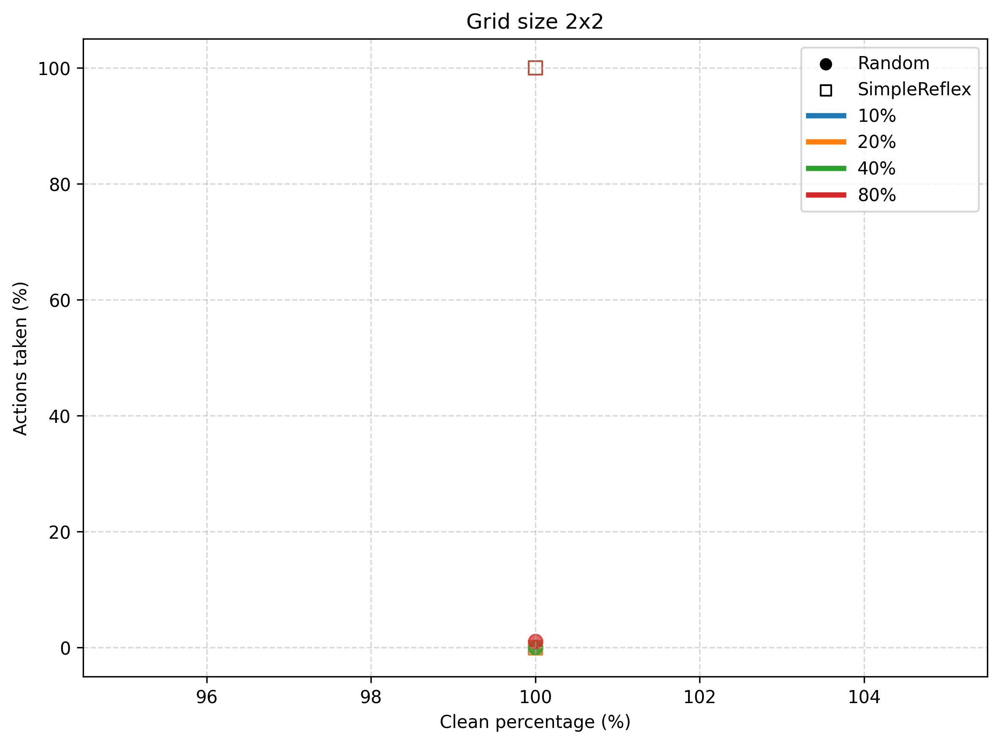
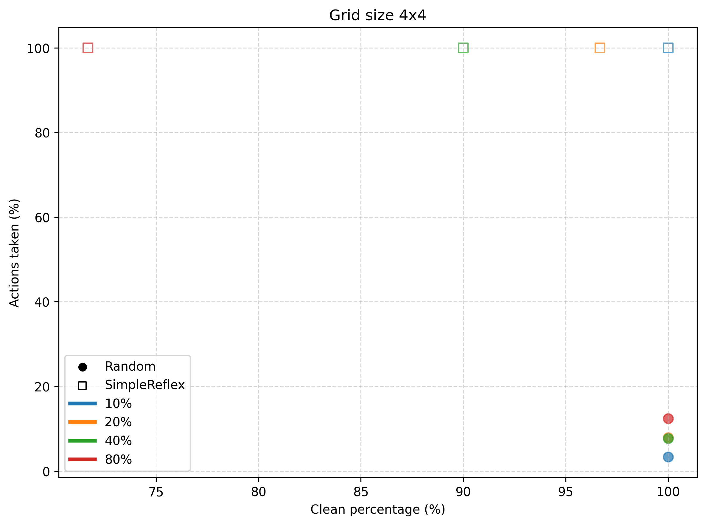
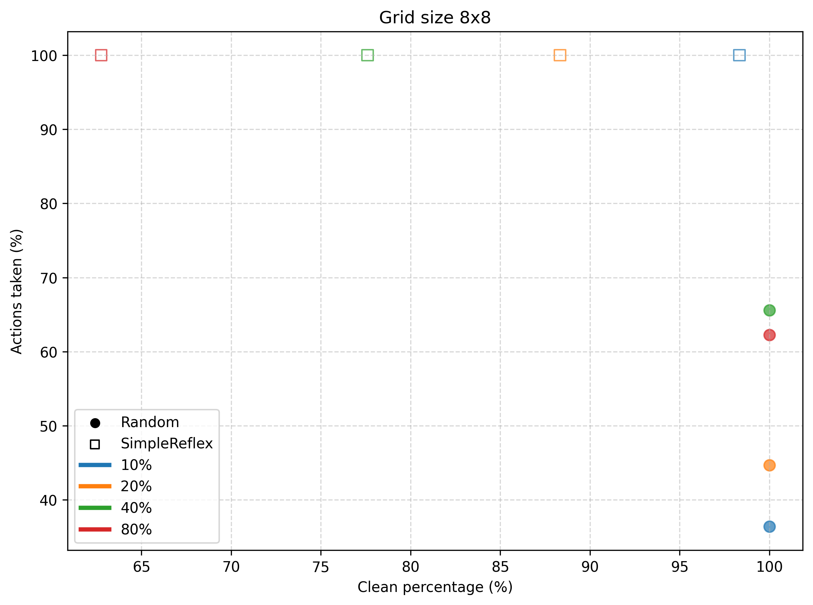
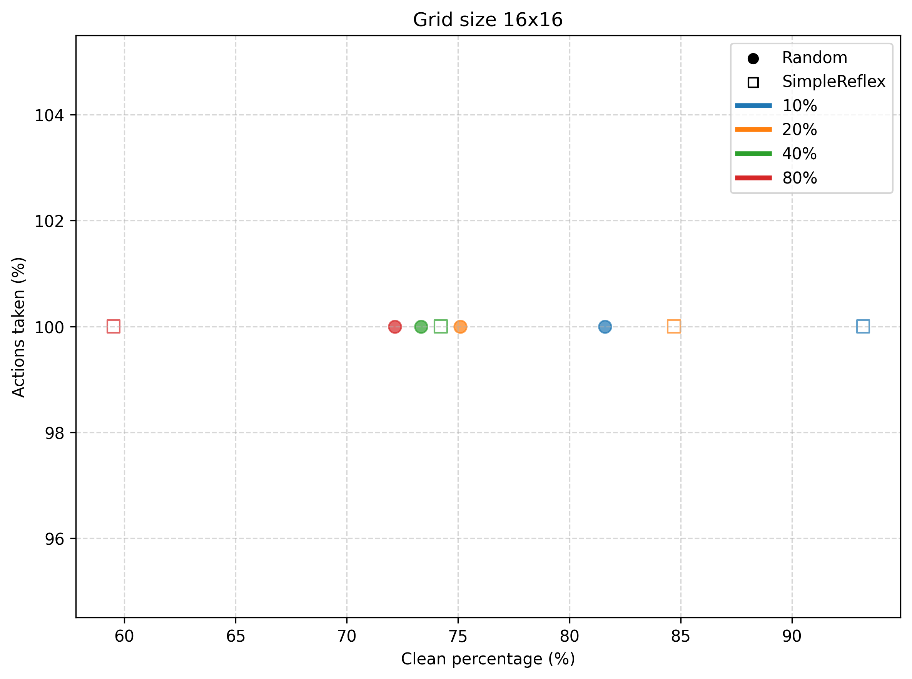
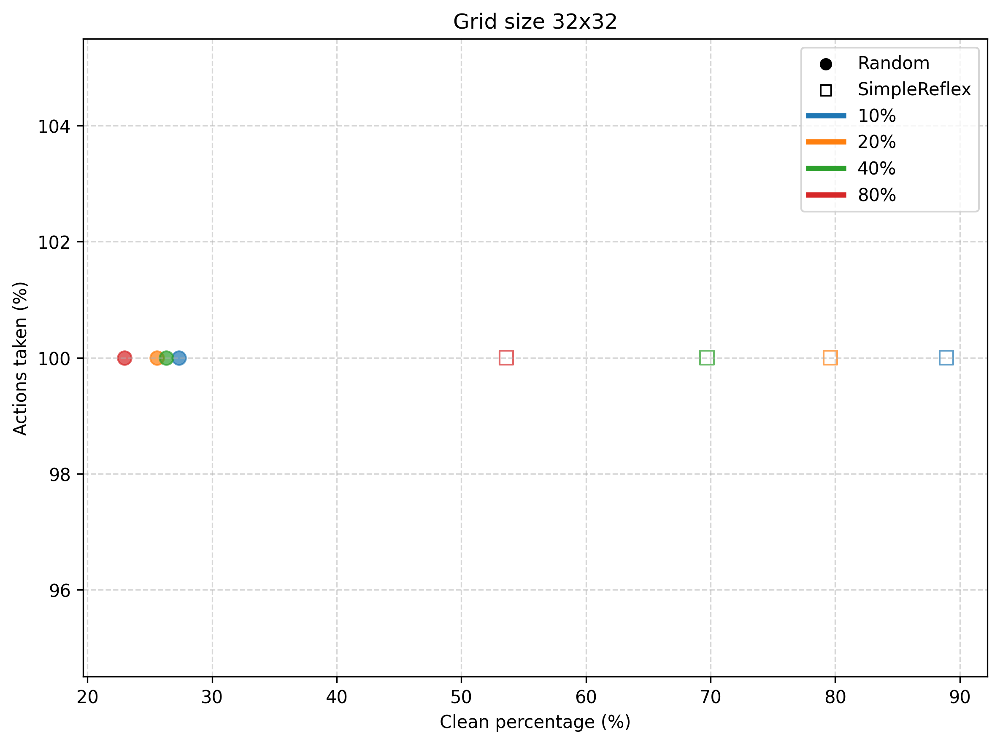
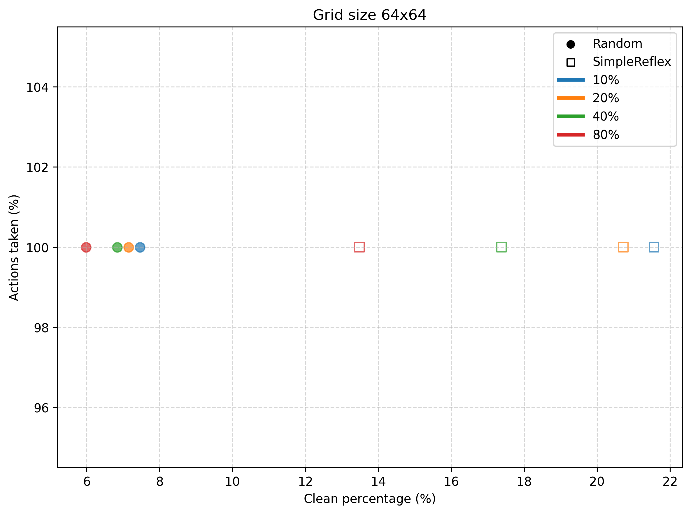
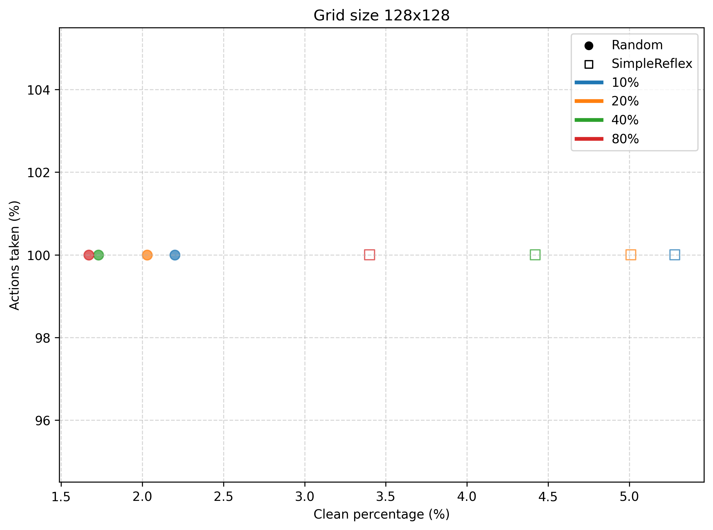

# Informe Comparativo: Agente Reflexivo Simple (Serpentina) vs Agente Random

Este informe analiza y compara el desempeño de dos agentes en el entorno de limpieza tipo *vacuum world*: el **Agente
Reflexivo Simple (Serpentina Adriano)** y el **Agente Random**.

---

## 1. Descripción de los agentes

**Agente Random**  
El agente selecciona movimientos de manera aleatoria, sin considerar posición, historial ni estructura de la grilla.

- Ventajas: simplicidad de implementación, y alta eficiencia en grillas pequeñas.
- Desventajas: ineficiencia cuando el tamaño de la grilla es alto en comparación con la cantidad de celdas que puede
  limpiar con las acciones disponibles (clústers en el centro de la grilla); puede repetir movimientos inútiles y no
  garantiza cobertura total de la grilla.

**Agente Reflexivo Simple (Serpentina)**  
Diseñado para barrer la grilla de forma sistemática en un patrón serpenteante (izquierda→derecha en filas pares,
derecha→izquierda en filas impares), previamente realizando una normalización mientras las acciones restantes sean
mayores al tamaño de la grilla por recorrer sumado a un estimado de acciones para limpieza (50%).

- Ventajas: garantiza mayor cobertura en un rango de grillas relativamente mayor a la del agente random, por lo tanto
  mayor % de limpieza.
- Desventajas: siempre consume todas las acciones disponibles, lo cual lo hace ineficiente en grillas pequeñas

---

## 2. Resultados comparativos

Se realizaron pruebas en grillas de distintos tamaños: **2x2, 4x4, 8x8, 16x16, 32x32, 64x64 y 128x128**, con porcentajes
de suciedad de: **10%, 20%, 40% y 80%**.
Los gráficos muestran la relación entre el porcentaje de limpieza alcanzado (`clean_pct`) en el eje x y las acciones
realizadas (`pct_actions_taken`) en el eje y.

### Grid 2x2 al 8x8

- *Nota*: El `dirt_rate` inicial no genera celdas sucias cuando la el porcentaje de suciedad es del 10% y 20%.
- **Random**: altamente eficiente, finaliza utilizando pocas acciones.
- **Serpentina**: aunque sobredimensionado para una grilla tan pequeña, asegura limpieza completa en un número mínimo de
  pasos.

### Grid 16x16

*Nota*: aquí ocurre el **punto de convergencia** entre rendimientos.

- **Random**: comienza a mostrar ineficiencia, muchas simulaciones terminan sin completar la limpieza, sobretodo cuando
  el % de suciedad es mayor al .
- **Serpentina**: consistente, limpieza total con recorrido sistemático.

### Grid 32x32

- **Random**: casi nunca logra limpieza completa, gasto elevado de movimientos.
- **Serpentina**: se mantiene eficiente y estable.

### Grid 64x64 al 128x128 y en adelante...

- **Random**: el fracaso crece notablemente, la probabilidad de cobertura completa es prácticamente nula.
- **Serpentina**: único agente capaz de mantener rendimiento confiable a gran escala.

## 3. Conclusiones

El **Agente Random** sirve únicamente como referencia base: su rendimiento es impredecible y poco escalable.
En contraste, el **Agente Reflexivo Simple (Serpentina)**, aun siendo un diseño extremadamente simple y *sin estado*,
logra un rendimiento superior en la mayoría de los escenario analizados.

La diferencia central es que el Serpentina transforma el problema en un recorrido determinista y sistemático. En
términos prácticos, el Serpentina constituye un punto de partida sólido para agentes más avanzados, mientras que el
Random ilustra claramente la necesidad de estrategias más allá del azar, sobretodo cuando el entorno varía en tamaño,
complejidad, y en naturaleza.

---
