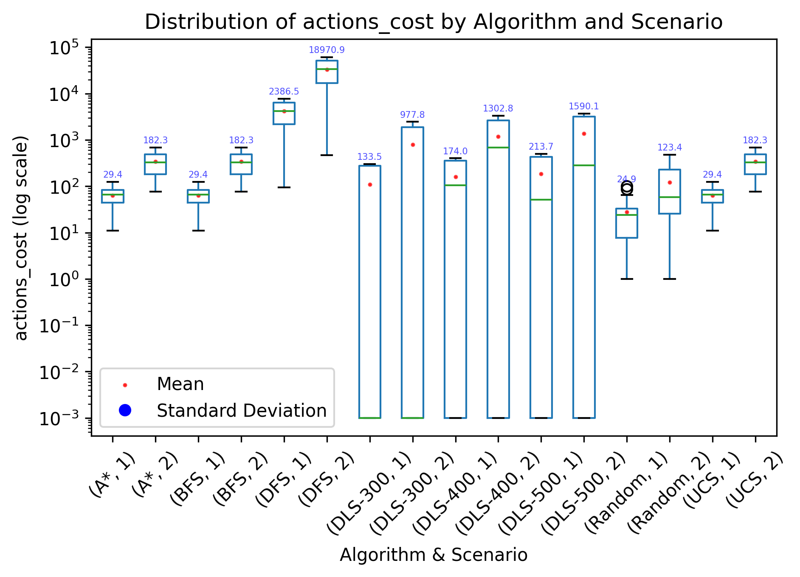
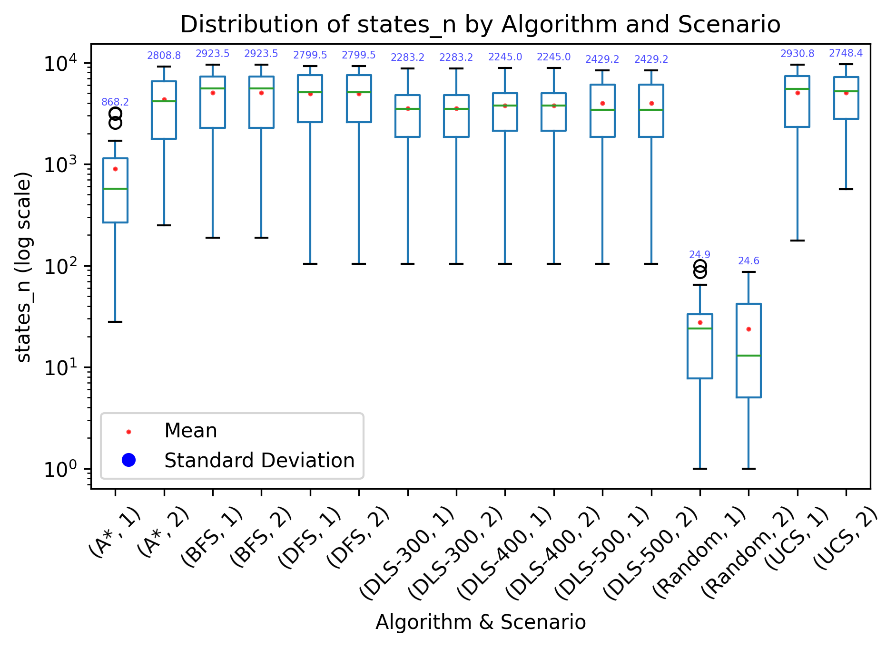
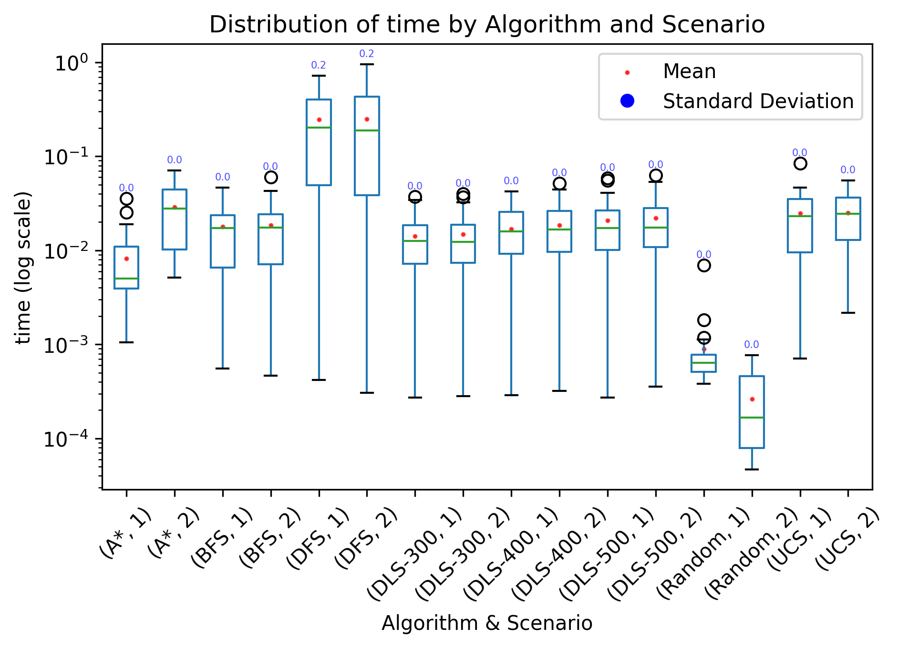

# TP3 — Informe comparativo de algoritmos de búsqueda

## 1. Contexto del problema

El entorno evaluado corresponde a variantes del FrozenLake de tamaño 100×100, con dos escenarios de costo:

1. Escenario 1: todas las acciones cuestan 1.
2. Escenario 2: los movimientos izquierda/derecha cuestan 1, mientras que arriba/abajo cuestan 10.

Se ejecutaron los algoritmos Random, BFS, DFS, DLS (con límites 300, 400 y 500), UCS y A\* sobre distintos entornos
aleatorios (`env_n`), tanto en la disposición de celdas congeladas como en posición de las celdas de inicio y de
llegada (objetivo).
Las métricas registradas fueron: número de estados explorados (`states_n`), número de pasos de la
solución (`actions_count`), costo acumulado (`actions_cost`), tiempo de ejecución (`time`) y un indicador de si se
encontró solución (`solution_found`).
La heurística utilizada en A\* fue la distancia de Manhattan entre el estado actual y el objetivo.

---

## 2. Figuras

   
  <em>Figure 1: Costos totales por solución</em>
    
   
  <em>Figure 2: Número de pasos por solución</em>
    
   
  <em>Figure 3: Cantidad de estados explorados</em>
    
   
  <em>Figure 4: Comparación de los tiempos de ejecución</em>

---

## 3. Resultados observados (promedios)

El análisis de los resultados muestra que BFS, UCS y A\* siempre encuentran soluciones óptimas en ambos escenarios. BFS
destaca por su rapidez (0.018 segundos en promedio) y simplicidad, explorando alrededor de 5050 estados. UCS tiene un
desempeño similar en cantidad de estados explorados (5050–5070), pero tarda un poco más (0.025 segundos) debido al
manejo de la cola de prioridad. A\* es el más eficiente en exploración: reduce el número de estados a 894 en el
escenario 1 y 4333 en el escenario 2, logrando además el menor tiempo en el escenario 1 (0.008 segundos), aunque en el
escenario 2 su tiempo aumenta (0.029 segundos).

DFS encuentra solución en todos los casos, pero con caminos mucho más largos y costosos (4171 pasos y costo 4171 en el
escenario 1; costo 33.234 en el escenario 2). DLS depende fuertemente del límite: con 300, solo resuelve 14 de 30 casos;
con 400 y 500, la tasa de éxito mejora levemente, pero los caminos siguen siendo más largos y costosos que los de BFS,
UCS o A\*.

---

## 4. Conclusiones

En síntesis, para este problema y tamaño de entorno, BFS es el algoritmo más adecuado: ofrece el mejor equilibrio entre
velocidad y calidad de solución, sin la sobrecarga heurística de A\*. A\* es recomendable para problemas de mayor
escala, donde la reducción en estados explorados puede compensar el mayor tiempo de cálculo. UCS es válido en entornos
con costos arbitrarios, pero no aporta ventajas significativas frente a BFS en este dominio.

---
