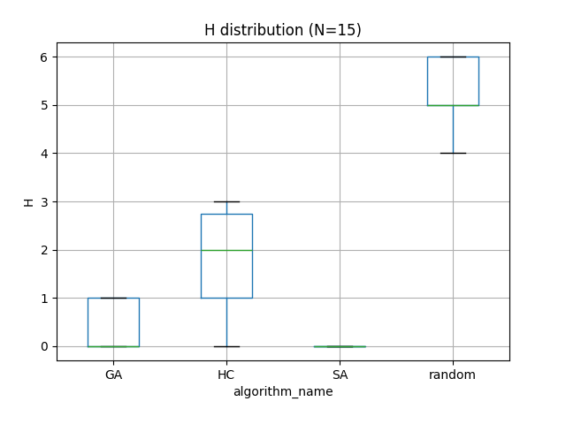
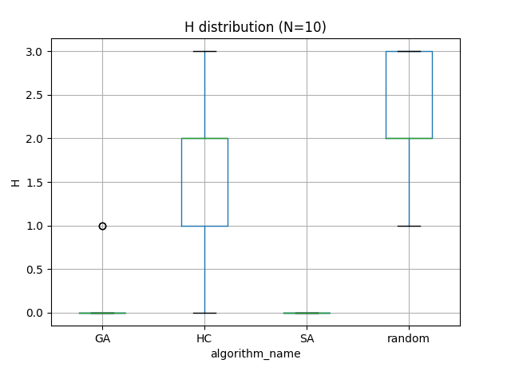

# Trabajo Práctico 4 - Inteligencia Artificial

## Metaheurísticas aplicadas al problema de las N-Reinas

### 1. Introducción

En este trabajo se implementaron y compararon distintos algoritmos de búsqueda y optimización aplicados al problema de
las N-Reinas: **Hill Climbing (HC)**, **Simulated Annealing (SA)**, **Algoritmos Genéticos (GA)** y un **algoritmo
aleatorio (Random)**.  
El objetivo fue observar cómo cada método enfrenta el espacio de búsqueda, qué tan rápido converge, y bajo qué
condiciones logran resolver el problema.

Todos los experimentos se realizaron con un límite de `MAX_STATES = 10000`.

---

### 2. Implementaciones

#### Ejercicio 1 — Hill Climbing

- Representación: vector `board` de longitud N, con `board[col] = row`.
- Vecindario: mover una reina a cualquier otra fila en la misma columna.
- Función objetivo: `H(board)` = número de pares de reinas en conflicto.
- Estrategia: steepest-ascent (se elige el mejor vecino de todo el tablero).
- Parada: `H = 0`, no hay vecinos mejores (óptimo local) o se alcanza `MAX_STATES`.

#### Ejercicio 2 — Simulated Annealing

- Inicio: con `t0 = 10` y `alpha = 0.9`, la temperatura inicial es suficiente para aceptar movimientos peores con
  bastante frecuencia. Esto provoca oscilaciones hacia arriba en H durante las primeras iteraciones.
- Desarrollo: a medida que avanza el tiempo, la temperatura va bajando de manera exponencial. Esto reduce gradualmente
  la probabilidad de aceptar soluciones peores, y el comportamiento de SA se va pareciendo más al de HC (descensos
  monótonos).
- Detención: SA se detiene al llegar a `MAX_STATES` o cuando encuentra `H = 0`. El schedule con `alpha = 0.9` asegura
  que la temperatura decaiga relativamente rápido, permitiendo exploración inicial y explotación al final, esto se puede
  ver con mejor detenimiento al considerar la escala de avances como logarítmica.

#### Ejercicio 3 — Algoritmo Genético

- Individuos: permutaciones de 0..N-1.
- Selección: torneo de tamaño k (usado k = 3).
- Reemplazo: generacional con elitismo = 2.
- Operadores: PMX (partially mapped crossover) y swap mutation.
- Parada: `H = 0`, `MAX_STATES` o número máximo de generaciones.

#### Ejercicio 4 — Algoritmo Aleatorio

- Estrategia: genera tableros aleatorios, guardando el mejor, hasta llegar a `MAX_STATES` o `H = 0`.

---

### 3. Diseño experimental

- Semillas: 30 corridas por algoritmo y por tamaño de tablero.
- Tamaños: N = 4, 8, 12, 15.
- Presupuesto: `MAX_STATES = 10000` en todos los casos.
- GA: `pop_size = 100`, `tournament_k = 3`, `elitismo = 2`.
- SA: schedule `exponencial` con `t0 = 10` y `alpha = 0.90`.

---

### 4. Análisis detallado del gráfico H vs log Step (N=15)

#### Hill Climbing (HC)

- Inicio: arranca con un tablero aleatorio con H relativamente alto.
- Desarrollo: H desciende de forma **monótona porque solo acepta mejoras**. Al comienzo hay reducciones fuertes y luego
  más lentas.
- Detención: alcanza un óptimo local o `H=0`. Se detiene mucho antes de los 10000 estados ya encuentra un óptimo local.

#### Algoritmo Genético (GA)

- Inicio: evalúa toda la población inicial (mucho coste al principio). Gracias a la representación por permutación, los
  individuos iniciales ya tienen H menor al azar puro.
- Desarrollo: reduce H muy rápido en las primeras generaciones, combinando buenos bloques mediante crossover y mutación.
- Detención: alcanza `H=0` en varias corridas o se corta por `MAX_STATES`. Su gasto en evaluaciones por generación hace
  que no pueda avanzar tantas generaciones.

#### Simulated Annealing (SA)

- Inicio: con `t0 = 10`, acepta movimientos peores con alta probabilidad, lo que genera oscilaciones hacia arriba en H.
- Desarrollo: a medida que la temperatura baja, cada vez acepta menos peores. La curva se vuelve más estable y tiende a
  descender.
- Detención: alcanza `MAX_STATES` o se enfría por completo. Con `alpha = 0.90` se procura un enfriamiento relativamente
  rápido, el comportamiento se asemeja al HQ luego de la iteración 10 de un total de 10,000 (0.1% del total).

#### Random

- Inicio: cada evaluación es un tablero independiente.
- Desarrollo: la curva mejora en saltos, de manera escalonada.
- Detención: siempre llega a `MAX_STATES`, no tiene criterio de parada anticipada.

---

### 5. Observaciones globales (boxplots)

- Para N=15: GA presenta la mejor mediana (muy cercana a 0) y poca variabilidad. HC queda segundo, resolviendo varios
  casos pero a veces atascado. SA muestra dispersión alta y rendimiento intermedio. Random es el peor en promedio.
  
- Para N=12: misma tendencia, aunque HC es un poco más competitivo.
  
- Para N=10, N=8: GA es el más estable; HC y SA se acercan.  
  
  
- Para N=4: todos los algoritmos logran resolver en la mayoría de las corridas.
  

---

### 6. Comparación agregada: Tiempo promedio y Estados explorados vs. N

Se añadieron gráficos que muestran, para cada algoritmo, el crecimiento del tiempo de ejecución promedio y la cantidad
promedio de estados explorados a medida que aumenta N (promedio sobre 30 semillas):

#### 6.1 Tiempo de ejecución

Tendencias principales:

- HC es sistemáticamente el más rápido. Su tiempo crece de manera suave (casi lineal respecto al aumento de vecinos
  evaluados) y se mantiene por debajo del resto en todos los tamaños.
- SA representa un comportamiento muy similar a HC. Esto ocurre porque el schedule converge rápido (exponencialmente) y
  el comportamiento se torna de exploitation puro (similar a HC) tras pocas iteraciones, el tiempo agregado es apenas
  mayor por la sobrecarga de cálculos de probabilidad.
- GA incrementa el tiempo más rápidamente con N debido a la evaluación de poblaciones completas. Su tiempo es mayor que
  HC y SA, pero la diferencia se reduce en N grandes (N=15) donde GA resuelve más casos.
- Random escala peor que HC/SA y que GA a partir de N=10, porque agota casi siempre el presupuesto completo de estados (10000) sin resolver, lo que deriva en tiempos mayores.

#### 6.2 Estados explorados

Tendencias principales:

- Random alcanza siempre `10000` estados para N ≥ 8 (línea plana en el máximo). Esto explica su pobre eficiencia:
  explora sin dirección hasta agotar el presupuesto.
- **GA** explora gran cantidad de estados porque cada generación evalúa el fitness de los individuos de toda la
  población. Aun así obtiene mejores tasas de solución que HC y SA en **N grandes, mostrando que en bajo tal condición
  su gasto se traduce en progreso**.
- **HC** incrementa los estados de forma moderada (cientos a pocos miles). El aumento refleja estancamiento en óptimos
  **locales**; **la tasa de solución cae marcadamente con N**.
- SA se estabiliza cerca de ~90 estados desde N=8 en adelante. Esto indica que su schedule (temperatura inicial +
  descenso exponencial) enfría demasiado rápido y deja de aceptar movimientos exploratorios antes de recorrer un número
  suficiente de vecinos; por eso la tasa de solución cae rápidamente con N.

#### 6.3 Tasa de resolución (solved_rate) asociada

(Valores observados en el resumen interno de métricas):

- GA: 100% (N=4,8), 93% (N=10), 73% (N=12), 53% (N=15).
- HC: 30% (N=4) y ≤10% para tamaños mayores (muy baja escalabilidad sin reinicios o diversificación).
- SA: 90% (N=4) pero cae a casi 0% ya desde N=8, efecto del enfriamiento agresivo.
- Random: solo resuelve consistentemente N=4; falla siempre para N ≥ 8.

### 7. Conclusión

En el problema de las N-Reinas, el Algoritmo Genético demuestra ser el método más robusto para tamaños grandes, logrando
un equilibrio entre exploración y explotación a costa de mayor tiempo y cantidad de estados explorados. Hill Climbing es
eficiente en tiempo, pero poco escalable sin mecanismos de diversificación, mientras que Simulated Annealing bajo
un régimen de enfriamiento exponencial independiente de N subexplora y pierde eficacia. El método aleatorio sirve como
línea base, mostrando la clara ventaja de los algoritmos dirigidos. Mejorar los parámetros de SA y añadir
diversificación a HC podrían aumentar
su rendimiento sin alcanzar el costo computacional del GA.
