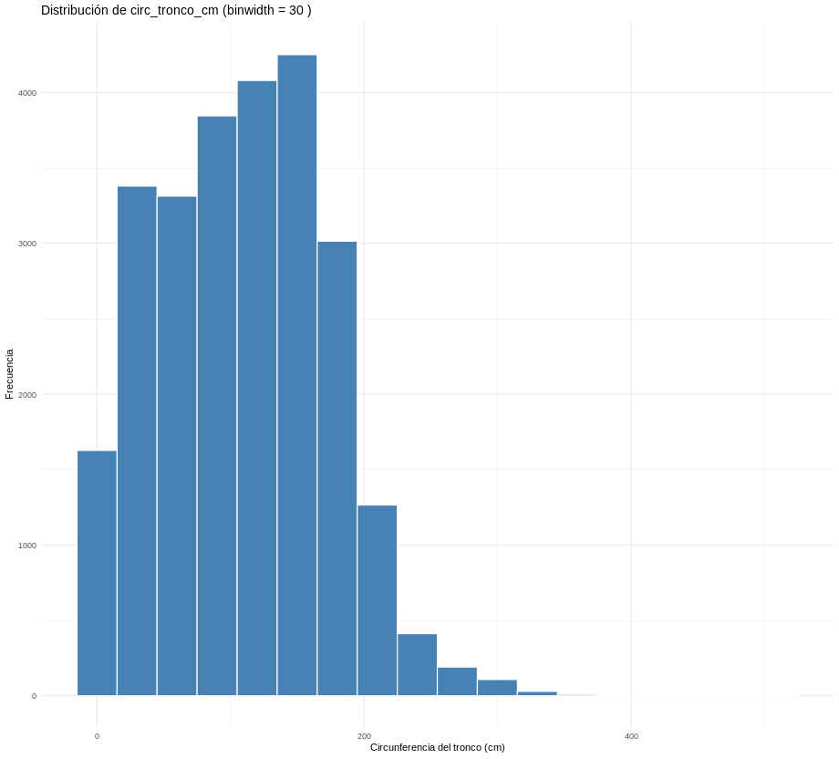

# Inteligencia Artificial - TP7B - Parte 1: Análisis Exploratorio de Datos (EDA)

## Universidad Nacional de Cuyo  
### Facultad de Ingeniería  
#### Licenciatura en Ciencias de la Computación  
##### Alumno: Adriano Fabris

---

## Ejercicio 2

### a) Distribución de la clase `inclinacion_peligrosa`

| inclinacion_peligrosa | count | percent |
|------------------------|-------|----------|
| 0 | 22666 | 88.8 |
| 1 | 2863  | 11.2 |


La clase se encuentra **fuertemente desbalanceada**, con casi nueve de cada diez árboles clasificados como “no peligrosos”.  
Este desequilibrio impacta directamente en la evaluación de los clasificadores: una alta exactitud puede ser engañosa si el modelo simplemente predice la clase mayoritaria.  
Por eso, además del *accuracy*, será necesario analizar métricas sensibles a este desbalance (sensibilidad, precisión y especificidad).

---
### b) ¿Se puede considerar alguna sección más peligrosa que otra?


Sí. La proporción de árboles peligrosos varía notablemente entre secciones.  
Por ejemplo:

| Sección           |     Total |     Peligrosos |     Proporción |
|-------------------|----------:|---------------:|---------------:|
| Barrio Cívico     |      2994 |            472 |         0.1588 |
| Residencial Norte |      5144 |            299 |         0.0581 |

Esto sugiere que existen factores locales (tipo de especies, densidad, mantenimiento, antigüedad del arbolado) que podrían estar influyendo en el riesgo de inclinación.

---

### c) ¿Se puede considerar alguna especie más peligrosa que otra?


La proporción de árboles peligrosos también varía entre especies.  
Si comparamos dos con cantidades similares de registros:

| Especie | Total | Peligrosos | Proporción |
|----------|--------|-------------|-------------|
| Acacia SP | 576 | 89 | 0.155 |
| Caducifolio | 366 | 22 | 0.060 |

La **Acacia SP** casi triplica el porcentaje de árboles peligrosos respecto al **Caducifolio**.  
Este patrón refuerza la hipótesis de que ciertas especies presentan mayor propensión a la inclinación peligrosa, posiblemente por estructura o condiciones del suelo.

---

## Ejercicio 3

### a) Exploración inicial de `circ_tronco_cm`

Se analizaron histogramas con 10, 20 y 30 bins.  
Valores con menos de 10 o más de 30 bins consideré que no aportaban información adicional ni mejoraron la legibilidad.




---

### b) Distribución según clase


#### Análisis del histograma para 10 bins
Para los árboles **no peligrosos**, la frecuencia se mantiene casi constante entre 10 cm y 180 cm de circunferencia, con una media cercana a 1000 observaciones.  
En cambio, los **peligrosos** presentan una forma aproximadamente normal, con un pico alrededor de los **140 cm**, y caídas hacia los **80 cm** y **200 cm** (ambos con frecuencias cercanas a 100).  
Esto sugiere que los árboles más gruesos tienden a ser los que desarrollan inclinaciones peligrosas.

---

### c) Categorización de `circ_tronco_cm`

A partir del análisis anterior se definieron los siguientes rangos, buscando reflejar los cambios abruptos observados en el histograma de 10 bins:

```r
train_data <- train_data %>%
  mutate(
    circ_tronco_cm_cat = case_when(
      circ_tronco_cm < 10  ~ "bajo",
      circ_tronco_cm < 100 ~ "medio",
      circ_tronco_cm < 180 ~ "alto",
      TRUE                 ~ "muy_alto"
    )
  )
```

Los resultados del dataframe se encuentran en el archivo: [arbolado-mendoza-dataset-circ_tronco_cm-train.csv](data/arbolado-mendoza-dataset-circ_tronco_cm-train.csv) 


---

## Conclusión

El análisis exploratorio reveló un conjunto desbalanceado, con patrones tanto espaciales como biológicos asociados al riesgo.
La circunferencia del tronco, la especie y la sección aparecen como variables relevantes a considerar en la fase de clasificación.

---